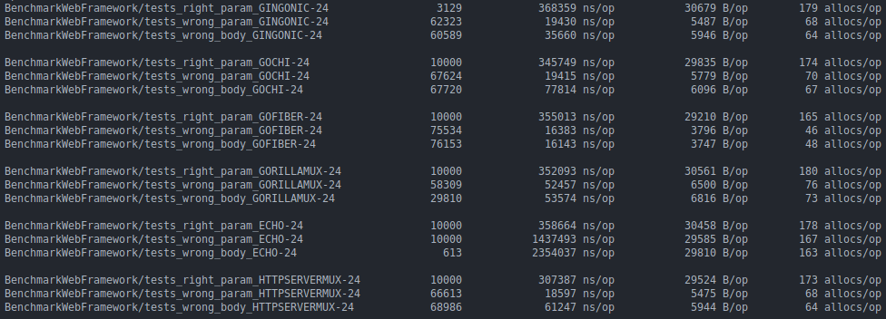

<h1 align="center">
    Go Benchmark
</h1>

Benchmark of the main Go web frameworks.

&nbsp;

#### Round 01: [benchmark](./round01)

###### Date: 20/08/2023

- [gin-gonic/gin v1.9.1](https://github.com/gin-gonic/gin/tree/v1.9.1)
- [go-chi/chi v5.0.10](https://github.com/go-chi/chi/tree/v5.0.10)
- [gofiber/fiber v2.48.0](https://github.com/gofiber/fiber/tree/v2.48.0)
- [gorilla/mux v1.8.0](https://github.com/gorilla/mux/tree/v1.8.0)
- [labstack/echo v4.11.1](https://github.com/labstack/echo/tree/v4.11.1)
- [net/http v1.21.0](https://pkg.go.dev/net/http)

&nbsp;

| Best                                                                   | Second                                          | Worst                                                                  |
| ---------------------------------------------------------------------- | ----------------------------------------------- | ---------------------------------------------------------------------- |
| [gofiber/fiber v2.48.0](https://github.com/gofiber/fiber/tree/v2.48.0) | [net/http v1.21.0](https://pkg.go.dev/net/http) | [labstack/echo v4.11.1](https://github.com/labstack/echo/tree/v4.11.1) |

&nbsp;

#### Round 02: [benchmark](.)

###### Date: --/--/2024

- [gin-gonic/gin v](https://github.com/gin-gonic/gin)
- [go-chi/chi v](https://github.com/go-chi/chi)
- [gofiber/fiber v](https://github.com/gofiber/fiber)
- [gorilla/mux v](https://github.com/gorilla/mux)
- [labstack/echo v](https://github.com/labstack/echo)
- [net/http v](https://pkg.go.dev/net/http)
